<div align="center">

# 🧩 Student Config Server

### Centralized Configuration Management for Distributed Microservices

[](https://spring.io/projects/spring-boot)
[](https://spring.io/projects/spring-cloud)
[](https://openjdk.org/)
[](LICENSE)

[Features](#-features) • [Architecture](#%EF%B8%8F-architecture) • [Quick Start](#-quick-start) • [Configuration](#%EF%B8%8F-configuration) • [Testing](#-testing-endpoints)

</div>

---

## 📖 Overview

The **Student Config Server** serves as the **centralized configuration hub** for the entire Student Microservices ecosystem. Built on **Spring Cloud Config**, it provides externalized configuration management from a Git-based repository, ensuring consistency, version control, and dynamic configuration updates across all environments.

### Why Config Server?

Managing configurations across multiple microservices and environments becomes complex as systems scale. The Config Server pattern solves this by:

- 🎯 **Single Source of Truth** - Centralized configuration management
- 🔄 **Version Control** - Git-based configuration with full history
- 🌍 **Environment Profiles** - Separate configs for dev, staging, production
- 🔥 **Hot Reload** - Update configurations without redeployment
- 🔒 **Security** - Encrypted sensitive properties

---

## ✨ Features

<table>
<tr>
<td>

- ✅ **Git-Backed Storage**
- ✅ **Multi-Environment Support**
- ✅ **Property Encryption**
- ✅ **RESTful Configuration API**

</td>
<td>

- ✅ **Automatic Configuration Refresh**
- ✅ **Service-Specific Configs**
- ✅ **Fallback Configurations**
- ✅ **Health Monitoring**

</td>
</tr>
</table>

---

## 🏗️ Architecture

```mermaid
graph TB
    A[📦 Git Repository] -->|Clone & Fetch| B[🧩 Config Server :8888]
    B -->|Serve Config| C[🌐 API Gateway]
    B -->|Serve Config| D[🧭 Eureka Server]
    B -->|Serve Config| E[👨‍🎓 Student Service]
    B -->|Serve Config| F[📚 Course Service]
    
    subgraph "Configuration Profiles"
        G[dev.properties]
        H[staging.properties]
        I[prod.properties]
    end
    
    A -.-> G
    A -.-> H
    A -.-> I
    
    style B fill:#4CAF50,stroke:#2E7D32,stroke-width:3px,color:#fff
```



### Service Configuration Flow

| Service | Port | Config File | Profile |
|---------|------|-------------|---------|
| **Config Server** | `8888` | `application.properties` | - |
| **API Gateway** | `8080` | `student-api-gateway-{profile}.properties` | dev/staging/prod |
| **Eureka Server** | `8761` | `student-eureka-server-{profile}.properties` | dev/staging/prod |
| **Student Service** | `808x` | `student-service-{profile}.properties` | dev/staging/prod |
| **Course Service** | `809x` | `student-course-service-{profile}.properties` | dev/staging/prod |

---

## 🚀 Quick Start

### Prerequisites

```bash
☑ Java 17 or higher
☑ Maven 3.8+
☑ Git repository for configurations
☑ GitHub account (or GitLab/Bitbucket)
```

### Step 1: Create Configuration Repository

```bash
# Create a new repository on GitHub
# Repository name: student-config-repo

# Clone locally
git clone https://github.com/YOUR_USERNAME/student-config-repo.git
cd student-config-repo

# Create configuration files
touch student-api-gateway-dev.properties
touch student-eureka-server-dev.properties
touch student-service-dev.properties
touch student-course-service-dev.properties

# Add sample configurations and commit
git add .
git commit -m "Initial configuration files"
git push origin main
```

### Step 2: Install & Run Config Server

```bash
# Clone the config server repository
git clone https://github.com/waseem-sk-dev/student-config-server.git
cd student-config-server

# Build the project
mvn clean install

# Run the application
mvn spring-boot:run
```

### Docker Deployment

```bash
# Build Docker image
docker build -t student-config-server:latest .

# Run container
docker run -p 8888:8888 \
  -e GIT_URI=https://github.com/YOUR_USERNAME/student-config-repo \
  student-config-server:latest
```

---

## 🗂️ Configuration Repository Structure

Your Git repository should follow this structure:

```
student-config-repo/
├── 📄 student-api-gateway-dev.properties
├── 📄 student-api-gateway-staging.properties
├── 📄 student-api-gateway-prod.properties
├── 📄 student-eureka-server-dev.properties
├── 📄 student-eureka-server-staging.properties
├── 📄 student-eureka-server-prod.properties
├── 📄 student-service-dev.properties
├── 📄 student-service-staging.properties
├── 📄 student-service-prod.properties
├── 📄 student-course-service-dev.properties
├── 📄 student-course-service-staging.properties
├── 📄 student-course-service-prod.properties
└── 📄 application.properties (shared config)
```

### Sample Configuration Files

**student-service-dev.properties**
```properties
# Database Configuration
spring.datasource.url=jdbc:mysql://localhost:3306/student_db_dev
spring.datasource.username=dev_user
spring.datasource.password={cipher}ENCRYPTED_PASSWORD
spring.jpa.hibernate.ddl-auto=update

# Server Configuration
server.port=8082

# Eureka Configuration
eureka.client.service-url.defaultZone=http://localhost:8761/eureka/

# Logging
logging.level.com.student=DEBUG
```

**student-service-prod.properties**
```properties
# Database Configuration
spring.datasource.url=jdbc:mysql://prod-db-server:3306/student_db
spring.datasource.username=prod_user
spring.datasource.password={cipher}ENCRYPTED_PASSWORD
spring.jpa.hibernate.ddl-auto=validate

# Server Configuration
server.port=8082

# Eureka Configuration
eureka.client.service-url.defaultZone=http://eureka-server:8761/eureka/

# Logging
logging.level.com.student=INFO
```

---

## ⚙️ Configuration

### application.properties

```properties
# ============================
# Server Configuration
# ============================
server.port=8888

# ============================
# Application Name
# ============================
spring.application.name=student-config-server

# ============================
# Git Repository Configuration
# ============================
spring.cloud.config.server.git.uri=https://github.com/YOUR_USERNAME/student-config-repo
spring.cloud.config.server.git.default-label=main
spring.cloud.config.server.git.clone-on-start=true
spring.cloud.config.server.git.timeout=10

# Optional: Private Repository Authentication
# spring.cloud.config.server.git.username=${GIT_USERNAME}
# spring.cloud.config.server.git.password=${GIT_PASSWORD}

# ============================
# Encryption Configuration
# ============================
# encrypt.key=${ENCRYPT_KEY}

# ============================
# Health & Monitoring
# ============================
management.endpoints.web.exposure.include=health,info,env,refresh
management.endpoint.health.show-details=always

# ============================
# Security (Optional)
# ============================
# spring.security.user.name=admin
# spring.security.user.password=${CONFIG_SERVER_PASSWORD}
```

### application.yml (Alternative)

```yaml
# ============================
# Server Configuration
# ============================
server:
  port: 8888

# ============================
# Spring Configuration
# ============================
spring:
  application:
    name: student-config-server
  
  cloud:
    config:
      server:
        git:
          uri: https://github.com/${GIT_USERNAME}/student-config-repo
          default-label: main
          clone-on-start: true
          timeout: 10
          # Private repo credentials (optional)
          username: ${GIT_USERNAME:}
          password: ${GIT_PASSWORD:}
          search-paths:
            - '{application}'
            - '{profile}'

# ============================
# Encryption
# ============================
encrypt:
  key: ${ENCRYPT_KEY:my-secret-key}

# ============================
# Management & Monitoring
# ============================
management:
  endpoints:
    web:
      exposure:
        include: health,info,env,refresh,configprops
  endpoint:
    health:
      show-details: always

# ============================
# Logging
# ============================
logging:
  level:
    org.springframework.cloud.config: DEBUG
```

### Environment Variables

```bash
# Git Repository
export GIT_USERNAME=your-github-username
export GIT_PASSWORD=your-github-token
export GIT_REPO_URI=https://github.com/your-username/student-config-repo

# Encryption
export ENCRYPT_KEY=your-encryption-key-min-256-bits

# Server
export SERVER_PORT=8888
```

---

## 🔐 Securing Sensitive Properties

### Generate Encryption Key

```bash
# Generate a strong encryption key
keytool -genkeypair -alias config-server-key \
  -keyalg RSA -keysize 2048 \
  -keystore config-server.jks \
  -storepass changeit
```

### Encrypt Properties

```bash
# Encrypt a password
curl http://localhost:8888/encrypt -d "mySecretPassword"

# Output: 682bc583f4b4e5f0f19f2e8b5c3d1a9e...

# Use in properties file
spring.datasource.password={cipher}682bc583f4b4e5f0f19f2e8b5c3d1a9e...
```

### Decrypt Properties

```bash
# Decrypt a value
curl http://localhost:8888/decrypt \
  -d "682bc583f4b4e5f0f19f2e8b5c3d1a9e..."
```

---

## 🧪 Testing Endpoints

### Health Check

```bash
curl http://localhost:8888/actuator/health
```

**Response:**
```json
{
  "status": "UP",
  "components": {
    "configServer": {
      "status": "UP",
      "details": {
        "repository": "https://github.com/waseem-sk-dev/student-config-repo"
      }
    }
  }
}
```

### Fetch Configuration by Service and Profile

```bash
# Get dev configuration for student-service
curl http://localhost:8888/student-service/dev

# Get prod configuration for api-gateway
curl http://localhost:8888/student-api-gateway/prod

# Get staging configuration for course-service
curl http://localhost:8888/student-course-service/staging
```

**Sample Response:**
```json
{
  "name": "student-service",
  "profiles": ["dev"],
  "label": "main",
  "version": "a1b2c3d4e5f6...",
  "state": null,
  "propertySources": [
    {
      "name": "https://github.com/waseem-sk-dev/student-config-repo/student-service-dev.properties",
      "source": {
        "server.port": "8082",
        "spring.datasource.url": "jdbc:mysql://localhost:3306/student_db_dev",
        "spring.datasource.username": "dev_user",
        "eureka.client.service-url.defaultZone": "http://localhost:8761/eureka/",
        "logging.level.com.student": "DEBUG"
      }
    }
  ]
}
```

### Fetch Raw Properties

```bash
# Get properties file directly
curl http://localhost:8888/student-service-dev.properties

# Get YAML format
curl http://localhost:8888/student-service-dev.yml

# Get JSON format
curl http://localhost:8888/student-service-dev.json
```

### Refresh Configuration (Without Restart)

```bash
# Trigger refresh on client service
curl -X POST http://localhost:8082/actuator/refresh
```

---

## 📦 Project Structure

```
student-config-server/
├── 📂 src/
│   ├── 📂 main/
│   │   ├── 📂 java/com/student/configserver/
│   │   │   ├── StudentConfigServerApplication.java
│   │   │   ├── 📂 config/
│   │   │   │   └── SecurityConfig.java
│   │   │   └── 📂 controller/
│   │   │       └── ConfigController.java
│   │   └── 📂 resources/
│   │       ├── application.properties
│   │       ├── application.yml
│   │       └── bootstrap.properties
│   └── 📂 test/
│       └── 📂 java/com/student/configserver/
│           └── ConfigServerIntegrationTest.java
├── 📄 pom.xml
├── 📄 Dockerfile
├── 📄 .gitignore
├── 📄 config-server.jks
└── 📄 README.md
```

---

## 🔧 Client Configuration

To connect microservices to the Config Server, add this to their `bootstrap.properties`:

```properties
# Application Name (must match config file prefix)
spring.application.name=student-service

# Config Server URI
spring.cloud.config.uri=http://localhost:8888

# Active Profile
spring.profiles.active=dev

# Fail Fast (fail startup if config server unavailable)
spring.cloud.config.fail-fast=true

# Enable Refresh
management.endpoints.web.exposure.include=refresh
```

### Client Dependencies (pom.xml)

```xml
<dependency>
    <groupId>org.springframework.cloud</groupId>
    <artifactId>spring-cloud-starter-config</artifactId>
</dependency>
<dependency>
    <groupId>org.springframework.cloud</groupId>
    <artifactId>spring-cloud-starter-bootstrap</artifactId>
</dependency>
<dependency>
    <groupId>org.springframework.boot</groupId>
    <artifactId>spring-boot-starter-actuator</artifactId>
</dependency>
```

---

## 🐳 Docker Compose

```yaml
version: '3.8'

services:
  config-server:
    build: .
    image: student-config-server:latest
    container_name: student-config-server
    ports:
      - "8888:8888"
    environment:
      - GIT_URI=https://github.com/waseem-sk-dev/student-config-repo
      - GIT_USERNAME=${GIT_USERNAME}
      - GIT_PASSWORD=${GIT_PASSWORD}
      - ENCRYPT_KEY=${ENCRYPT_KEY}
    healthcheck:
      test: ["CMD", "curl", "-f", "http://localhost:8888/actuator/health"]
      interval: 30s
      timeout: 10s
      retries: 3
    networks:
      - student-network

networks:
  student-network:
    driver: bridge
```

---

## 📊 Monitoring & Observability

### Actuator Endpoints

| Endpoint | Description |
|----------|-------------|
| `/actuator/health` | Health status of config server |
| `/actuator/info` | Application information |
| `/actuator/env` | Environment properties |
| `/actuator/refresh` | Refresh configuration |
| `/actuator/configprops` | Configuration properties |

### Metrics Integration

```properties
# Add to application.properties for Prometheus support
management.metrics.export.prometheus.enabled=true
management.endpoint.prometheus.enabled=true
management.endpoints.web.exposure.include=health,info,prometheus
```

---

## 🔄 Configuration Refresh Strategies

### 1. Manual Refresh (Spring Boot Actuator)

```bash
curl -X POST http://localhost:8082/actuator/refresh
```

### 2. Spring Cloud Bus (Automatic)

Broadcast refresh events to all services:

```bash
curl -X POST http://localhost:8888/actuator/bus-refresh
```

### 3. Webhook Integration (GitHub)

Configure GitHub webhook to trigger refresh on commit:
- **Payload URL:** `http://your-server:8888/monitor`
- **Content Type:** `application/json`
- **Events:** Push events

---

## 🛡️ Best Practices

1. **Version Control**: Always commit configuration changes with meaningful messages
2. **Environment Separation**: Use separate profiles for dev, staging, and production
3. **Encryption**: Encrypt all sensitive data (passwords, API keys, tokens)
4. **Fallback Configuration**: Provide default values in `application.properties`
5. **Access Control**: Secure config server with authentication
6. **Monitoring**: Enable health checks and alerts
7. **Testing**: Test configuration changes in lower environments first
8. **Documentation**: Document all configuration properties

---

## 🤝 Contributing

Contributions are welcome! Please follow these steps:

1. 🍴 Fork the repository
2. 🌿 Create a feature branch (`git checkout -b feature/config-enhancement`)
3. 💾 Commit your changes (`git commit -m 'Add configuration caching'`)
4. 📤 Push to the branch (`git push origin feature/config-enhancement`)
5. 🔃 Open a Pull Request

Please ensure your code follows Spring Boot best practices and includes appropriate tests.

---

## 🐛 Troubleshooting

### Config Server Not Starting

```bash
# Check if Git repository is accessible
git clone https://github.com/YOUR_USERNAME/student-config-repo

# Verify Java version
java -version

# Check logs
tail -f logs/config-server.log
```

### Client Cannot Connect

```bash
# Verify config server is running
curl http://localhost:8888/actuator/health

# Check client bootstrap.properties
# Ensure spring.cloud.config.uri is correct
```

### Configuration Not Updating

```bash
# Trigger manual refresh
curl -X POST http://localhost:8082/actuator/refresh

# Verify Git repository has latest changes
curl http://localhost:8888/student-service/dev
```

---

## 📚 Additional Resources

- [Spring Cloud Config Documentation](https://spring.io/projects/spring-cloud-config)
- [Configuration Management Best Practices](https://docs.spring.io/spring-cloud-config/docs/current/reference/html/)
- [Encryption & Decryption Guide](https://cloud.spring.io/spring-cloud-config/reference/html/#_encryption_and_decryption)

---

## 📝 License

This project is licensed under the **MIT License** - see the [LICENSE](LICENSE) file for details.

---

## 👨‍💻 Author

<div align="center">

### Waseem Shaikh

**Backend Developer** | Java • Spring Boot • Microservices

[](https://github.com/waseem-sk-dev)
[](https://linkedin.com/in/waseem-sk-dev)
[](mailto:waseem@example.com)

</div>

---

## 🌟 Acknowledgments

- Spring Cloud Config team for the robust framework
- The open-source community for continuous improvements
- Contributors who help make this project better

---

<div align="center">

**⭐ Star this repository if you find it helpful!**

Made with ❤️ by [Waseem Shaikh](https://github.com/waseem-sk-dev)

</div>
